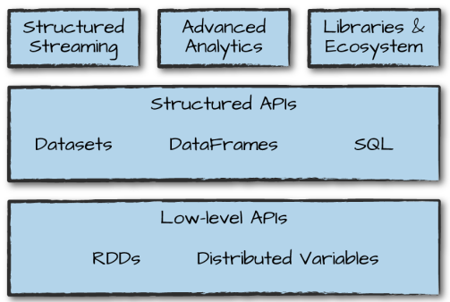
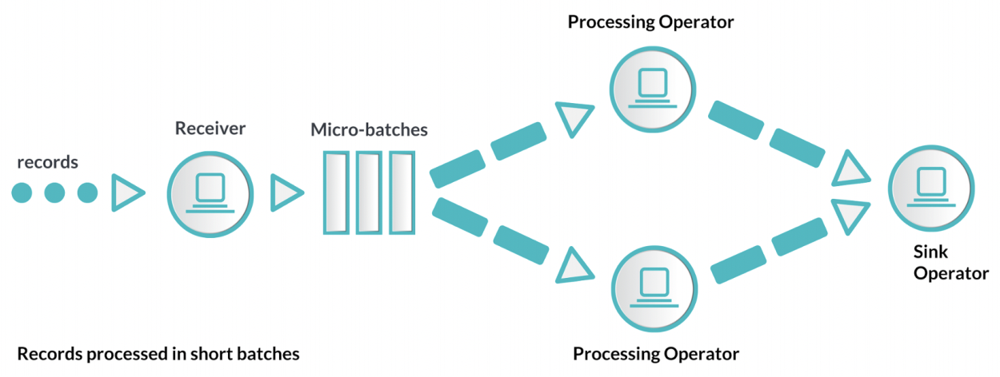

# [Tacademy] 아파치 스파크 입문

- 참고 자료

    [아파치 스파크 입문 | T아카데미 온라인강의](https://tacademy.skplanet.com/live/player/onlineLectureDetail.action?seq=193)

# [1강] Spark의 개념과 활용

## Apache Hadoop

- 특정 기술이라기보다는 하둡 클러스터 내지는 하둡 환경을 통칭
    - Hadoop Distributed File System(HDFS) : 분산 파일 시스템
    - YARN : 여러 어플리케이션을 돌리기 위해 리소스를 관리하는 클러스터 매니저
    - Hadoop MapReduce : 분산 프로세싱
    - Hadoop Common : 모니터링, 코디네이터, 파이프라이닝, SQL 기술 등

## HDFS

- Google File System(GFS)에서 2004년 시작
- **하둡 에코시스템에서 분산 파일 시스템**을 지원
- **큰 파일들을 저장하고 처리**될 수 있도록 지원
- Hardware failures에 대처할 수 있는 신뢰성

    → 병렬처리에서 문제가 생겼을 때 재연산을 하기 위해 HDFS에서 copy를 저장

- 작고 많은 파일에 취약하며, 디스크 I/O로 인한 latency
- HDFS의 구조
    - Master - Slave

        

    - Master Node : 메타 데이터(어떤 Data Node에 어떤 block 단위로 저장되어 있는지)를 관리하는 Name Node

        → 데이터는 Data Nodes에 block 단위로 저장이되지만, Name Node에 장애가 발생하면 모든 메타 데이터가 없어지기 때문에 고가용성 보장 필요

    - Slave Nodes : 실제로 데이터를 block 단위로 저장하는 Data Nodes
- Block
    - **파일을 block 단위로 나누고, 해당 단위로 read/write**
    - Replication of Blocks : 3 copy(default)
        - fault tolerance(장애에 대한 복구)를 위해 파일을 copy

            → 온프리미스 기준으로 Data Node가 죽는 일이 많음 : disk failed, 네트워크 문제, OS fault 등

        - 잘 분배되어 저장되어 있을 경우 병렬성이 증가함

## Hadoop MapReduce

- 하둡 에코시스템의 기본적인 프로그래밍 패러다임
- 전통적인 병렬 프로그래밍에선 전문성이 필요(멀티 스레드, 동기화, 정확성/성능fault toerance 보장의 어려움 등)

    → MapReduce : 코드를 병렬적으로 돌리기 쉬운 프로그래밍 모델

## Apache Spark

- **기존 MapReduce 프레임워크보다 빠르고 범용적으로 사용하는 컴퓨팅 시스템**
    - MapReduce의 경우 disk I/O로 인하여 느리지만, Spark는 In-memory 방식으로 처리하여 network I/O나 disk I/O를 줄일 수 있음
    - MapReduce는 low-level API를 활용하여 더 많은 핸들링을 할 수 있지만, Spark는 Scala 언어로 개발되어 함수형 언어의 장점을 가지기 때문에 코드가 간결하고 개발의 생산성이 높음
- 반복적으로 데이터에 접근하여 연산하는 머신러닝에 적합
- **컴퓨터 클러스터에서 병렬 데이터 프로세싱을 하는 라이브러리의 집합이자 통합 컴퓨팅 엔진**

    

- 다양한 소스에서 다양한 형태의 데이터를 읽고 쓰며, 데이터 분석/머신러닝/그래프 분석/ 실시간 스트리밍 데이터 처리 등의 작업 지원

    

- 기본 아키텍처

    

    1. spark-submit 통해서 Cluster Manage에 user code를 제출

        (리소스를 얼마나 쓸지 지정 : Executor 개수, Core 수, Memory 수)

    2. Driver Process가 생성되고, Driver Process에서는 Spark Session 생성
    3. 다수의 Executors에 코드를 할당하여 실행
- 활용 케이스
    - Streaming Data
    - Machine Learning
    - Interactive Analysis → latency가 적기 때문에 빠른 분석 가능
    - Data Warehousing
    - Batch Processing → 대부분은 Hive로 많이 수행
    - Exploratory Data Analysis(EDA)
    - Graph Data Analysis
    - Spatial(GIS) Data Analysis
- Spark은 컴퓨팅 프레임워크로 HDFS나 DB를 대체하는 것이 아니고, 모든 케이스에 적절하지도 않음
    - **단순한 케이스에는 데이터와 복잡성과 안정성 측면에서 MapReduce와 Hive가 더 적절할 수 있음**
    - BI와 같은 multi-user 환경으로 설계되지 않음

        → storage에 있는 데이터를 읽기 때문에 disk I/O 발생하고 DB만큼의 성능이 나오진 않음

    - user가 늘어나면 **메모리 사용에 신경을 많이 써야함**

# [2강] Spark의 실시간/배치

## Big Data Processing

- Batch Processing : 전일자/전월자 등 큰 데이터의 summary 테이블 생성
    - 데이터가 크고 복잡하지만 latency를 가져도 됨
    - ex) MapReduce
- Stream Processing : 데이터가 온 즉시 바로 처리

    

    - 데이터가 바로 처리되어야하기 때문에 연산이 단순하고 독립적이여야 함
    - sub-second latency
    - ex) Storm, Flink
- Micro-Batching : 배치와 스트리밍이 결합된 형태

    

## Spark Streaming

- 실시간 처리가 아닌 small batch

    

- Discretized Stream Processing : 작고 deterministic한 일련의 배치, Spark은 각 배치를 RDD로 취급하고, RDD Operation을 통해 처리
- Checkpointing : 생성된 RDD들을 Checkpointing을 통해서 저장하고, 실시간으로 처리하다가 문제가 생기면 재연산
    - time interval 단위가 너무 커지면 복구시간과 재연산 시간이 증가
    - 비즈니스 요건마다 다르지만, 데이터의 누락이 없어야 한다면 ZooKeeper나 HBASE 통해서 offset 관리
- Accumulator & Broadcast : RDD의 distributed(shared) variable
    - Accumulator : 클러스터 전체에서 증분이 가능한 데이터 구조
        - ex) 디버깅을 위한 error count → 드라이버에 메모리 이슈를 야기할 수 있기 때문에 운영 단계에서는 사용하지 않음
    - Broadcast : 클러스터에서 read only로 가지고 있는 불변하는 기준 정보
        - ex) large lookup table → long running process여서 JVM GC 문제 발생 가능하기 때문에 Spark Streaming에서는 주의
- 아키텍처에서의 고려사항
    - Scalability : scale-out 가능한 구조
    - Distributed Processing : CPU와 메모리 자원의 확보
    - Fault tolerant : 어플리케이션 정책에 따라 다름
        - 실패된 작업보다는 현재 들어오고 있는 실시간 데이터의 처리가 중요
        - 데이터 누락이 있으면 안되는 경우, ZooKeeper를 통한 실패 작업 관리
    - Enterprise constrains: SLA(서비스 수준 협약) → job scheduling, reprocessing, cluster 등
- 활용 케이스
    - 실시간 모니터링
    - 실시간 BI
    - Operational Intelligence : 특정 조건에 트리거링 되었을 때 동작(알람 등)
    - 제조라인
- 성능 튜닝
    - Spark Streaming은 계속 띄워놔야 하고, 드라이버가 죽으면 하둡이 재실행하지만 원인 분석이 필요하여 JVM 모니터링 → 메모리 이슈가 많음
    - Batch and Window Sizes
        - 0.5초가 적합
        - 10초 정도로 배치 사이즈를 잡고 줄여나가는 것이 좋고, bottleneck이 있을 경우 늘림
    - Level of Parallelism : 병렬성
        - reveiver의 수 증가(kafka에서는 topic repartition)
        - 받은 데이터의 repartitioning → 전체 데이터가 셔플링되기 때문에 주의
        - 집계시 groupByKey가 아닌 reduceByKey를 사용
    - GC and Memory Usage
        - JVM 모니터링 필요
- Batch와 Streaming 클러스터를 따로 구성하지는 않음
    - YARN에서 queue를 분리하여 리소스를 isolation

## Kafka

- 분산되고, 파티션되고, 복제(HDFS와 같이 copy하여 저장)되는 커밋 로그 서비스 → 분산 메시징 서버

    

- 하나의 데이터에 대해 여러 consumer group이 사용

## Structured Streaming

- DataFrame 기반으로 Structured Streaming 지원
    - Spark SQL 엔진에서 High-level streaming API를 만든 것
- Continuous Application

    

- Watermark : 늦은 데이터를 처리하기 위해 기다려주는 threshold
- Joining : static 데이터를 Join 할 수 있음
- 다양한 output mode : append, complete 등